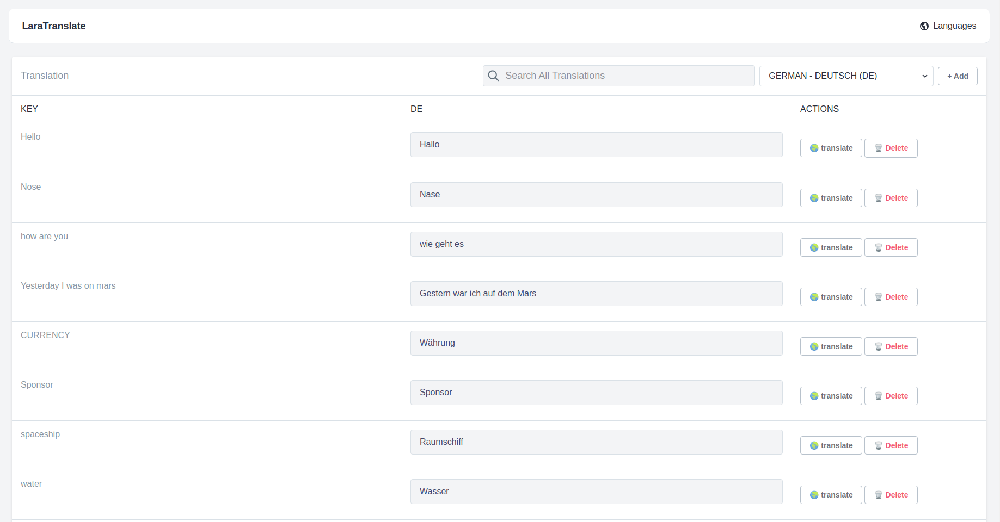

<div align="center">
  
Translation Management and Key Translation in one place.



</div>

------

## About Lara Translate

Lara Translate is a package that enables you to manage your translations efficiently. One of its remarkable features is the ability to seamlessly translate keys from one language to another directly from the User Interface. More impressive Thing is that it works for free. Behind the scenes, it leverages the MyMemory API to handle key translations.

The package allows you to manage your translations using the native file based translations.

You can add new translation files. You can also add, delete or translate the tranlation keys.

## Installation

Install the package via Composer

`composer require manadinho/lara-translate`

Publish configuration, views and assets

`php artisan vendor:publish --provider="Manadinho\LaraTranslate\LaraTranslateServiceProvider"`

It will publish a config file `laraTranslate.php` for the package, views for the package inside `views/vendor/lara-translate`, It will also publish the assets including css file for the package.

Now just visit this url in browser to see the Lara Translate screen.
http://{project-domain}/lara-translate/

## Usage

### Configuration

We can manage the settings of the package from this file. These are the details.

```
source_language [string/language_code]
```
Here we can define the source language for performing the translation of translation keys. Default source_language is 'en'. Use language code which you want to use as source_language.

```
show_translate_button [boolean]
```
You can also control if you want to show the translate button for the translation keys.

```
show_delete_button [boolean]
```
You can also control if you want to show the delete button for the translation keys.

```
middlewares [array]
```
Add middlewares that you want to apply on the package routes.

```
uri_start [string]
```
This is th first segment of URI. By default the first segment of URI will be 'lara-translate'. e.g. http://{project-domain}/lara-translate/ . But you can also customize this here.

```
translation_methods [string]
```
The methods to use when searching for missing translation keys in project.

```
scan_paths [array]
```
Paths of the directories that need to be used to search missing translation keys. 

### Artisan Commands
The package includes Artisan commands to manage the translations.
  
```
lara-translate:show-missing-translation-keys
```
Shows missing translation keys against the translations/locales. Package searches for the missing translation keys from the directories given in `scan_paths` in config file.

```
lara-translate:sync-missing-translation-keys
lara-translate:sync-missing-translation-keys --lang=de
```
This command will look for the missing translation keys and add the keys in translation files. If you want to sync specific translation file, you can simply provide the file name.

